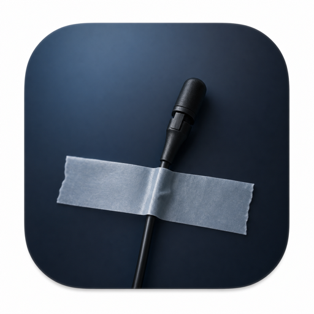

# wire

<p align="center">
  
</p>

`wire` is a small macOS menu bar voice transcriber. It records from your microphone, sends audio to the same ChatGPT/Codex transcription endpoint used by Codex dictation, then copies/pastes the transcript.

## Requirements

- macOS 14+
- Xcode command line tools / SwiftPM
- You must be logged into Codex/ChatGPT so `~/.codex/auth.json` exists.
- Microphone permission for the app.
- Accessibility permission if you want `wire` to paste text into the active app.

## Run locally

```bash
./run.sh
```

`run.sh` builds if needed, packages `dist/wire.app`, and opens it.

## Install to `/Applications`

```bash
./install.sh
```

`install.sh` builds if needed, packages `dist/wire.app`, copies it to:

```text
/Applications/wire.app
```

and opens it. If `/Applications` requires admin rights, the script will ask via `sudo`.

## Usage

- Menu bar icon: microphone only.
- Two shortcuts are available:
  - **Toggle shortcut**: press once to start, again to stop and transcribe.
  - **Hold shortcut**: hold to record, release to stop and transcribe.
- The latest transcript appears in the popover, with a copy button beside it.
- If **Paste result** is enabled, the transcript is copied to the clipboard and pasted into the active app.
- Enable **Launch at login** in Settings to start `wire` automatically when you log in.

## Troubleshooting

If transcription hangs or fails:

1. Make sure Codex auth exists:

   ```bash
   test -f ~/.codex/auth.json && echo ok
   ```

2. Relaunch the app:

   ```bash
   killall wire 2>/dev/null
   ./run.sh
   ```

3. If paste does not work, grant Accessibility permission to `wire` in System Settings.
